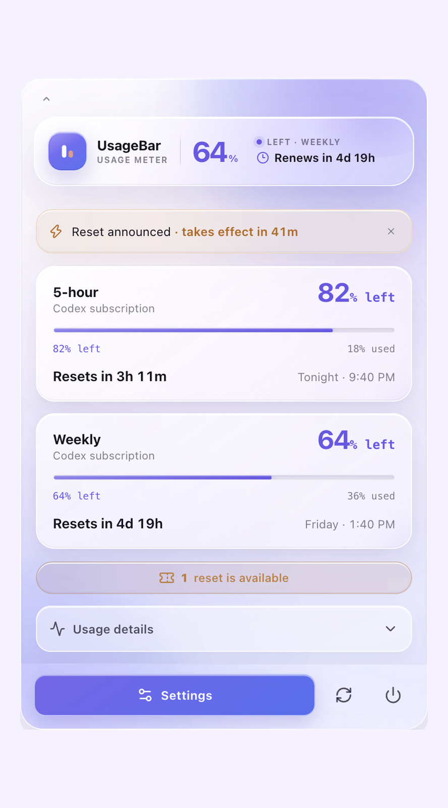
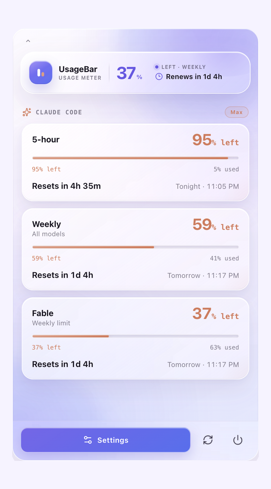

# UsageBar

**Codex and Claude Code quota windows and reset times, at a glance.**

UsageBar is a small, local-first macOS menu-bar app for seeing current AI-coding quota windows, how much remains, and exactly when each window resets. Codex data comes from your existing Codex login through the official Codex App Server—no OpenAI API key and no credential scraping. If Claude Code is installed, a second meter shows its 5-hour and weekly windows too.

The menu bar shows one live meter per provider: a tiny provider mark plus a `42% · 1:25:49`-style **used-percentage** and reset countdown for the most-used window — the same "% used" convention Codex and Claude Code report themselves, so the numbers always agree. By default each meter follows whichever window is most used — for Claude that is often a per-model weekly limit like Fable — and you can pin a specific window in Settings. The tooltip always names the window on display. The popover is built with a native macOS glass (vibrancy) look, and Tibo Watch watches [@thsottiaux](https://x.com/thsottiaux) for surprise-reset announcements and sends a local notification when a fresh one lands.

| Codex meters & reset radar | Claude Code meters |
| :---: | :---: |
|  |  |

*Screenshots show preview data.*

Open **Settings** in the popover (or right-click a menu-bar icon) to choose which quota window each meter follows — most used, 5-hour, weekly, or a per-model limit like Fable — plus **Compact Meter** (percentage only), **Usage Alerts** (notifications at 80% / 95% used and on a fresh window), and **Launch at Login**.

## Install

Download the latest `.dmg` from [Releases](https://github.com/abdelrahmanmagdii/usage-tracker/releases),
open it, and drag UsageBar to Applications. Builds are signed and notarized by
Apple, so they open without a security warning.

Or build it yourself:

```sh
git clone https://github.com/abdelrahmanmagdii/usage-tracker.git
cd usage-tracker
npm install
npm run tauri build
```

The app lands in `src-tauri/target/release/bundle/macos/`.

Maintainers: see [docs/RELEASING.md](docs/RELEASING.md) for how signed releases are cut.

## Requirements

- macOS 10.15 or newer
- A working, authenticated `codex` CLI
- Optional: a signed-in Claude Code install for the Claude meter
- Node.js 20+ and Rust for development

## Run locally

```sh
npm install
npm run tauri dev
```

Click the meter icon in the macOS menu bar to toggle the popover. In development, the window also opens on launch for easier inspection.

Useful checks:

```sh
npm run typecheck
npm test
cargo test --manifest-path src-tauri/Cargo.toml
npm run tauri build -- --debug
```

## How it works

The Rust process owns one managed `codex app-server --stdio` child process. It performs the required `initialize` / `initialized` handshake, reads `account/read`, `account/rateLimits/read`, and (when available) `account/usage/read`, and routes responses by request ID. Rolling `account/rateLimits/updated` notifications trigger an immediate refresh. The UI updates countdowns locally once per second; it does not poll App Server for every tick.

Background freshness is defended three ways: the process opts out of App Nap (macOS otherwise throttles hidden menu-bar apps until you click them), staleness is measured against the wall clock so refreshes catch up within seconds of the Mac waking from sleep, and a refresh that fails while "connected" restarts the app-server child instead of retrying a dead pipe.

### Claude Code

Claude Code has no local app-server equivalent, so the Claude meter reads the OAuth session that Claude Code itself maintains — the macOS Keychain item `Claude Code-credentials` first, then the `~/.claude/.credentials.json` fallback — and asks Anthropic's own usage endpoint (the same one behind Claude Code's `/usage` screen) for the current 5-hour, weekly, and model-scoped windows. Access is strictly read-only: the token is never refreshed, rewritten, or sent anywhere except `api.anthropic.com`, so this app can never invalidate your Claude Code session. macOS will ask once whether to allow the Keychain read; choose "Always Allow" to keep background refresh silent.

If no Claude Code login exists on the Mac, the Claude tray icon and popover section stay hidden entirely.

Protocol assumptions were checked against TypeScript bindings generated by the locally installed Codex CLI (`codex app-server generate-ts`). The renderer intentionally uses narrow, defensive application types so new or unknown response fields do not break the app.

The app is split into:

- `src/features` — Tibo Watch (feed provider, notifications) and share-card generation
- `src/lib` — defensive parsing, formatting, persistence, and reset detection
- `src-tauri/src/codex` — process lifecycle and JSONL protocol routing
- `src-tauri/src/tray.rs` — menu-bar meter: quota-aware pill icon plus `% · countdown` title
- `tools/tibo-watch` — the zero-cost scraper behind the public reset feed
- `data/resets.json` — the canonical reset event store (edit this to backfill)

## Privacy

Private usage stays on this Mac. UsageBar does not read Codex credential files, expose authentication tokens, or send quota data to a remote server. The backend strips the account email before state reaches the renderer. Share cards contain only a quota percentage, window label, and reset countdown.

**About the Claude Code token, specifically.** The Claude meter is the only part of the app that touches a credential, so here is exactly what it does — the entire implementation is one auditable file, [`src-tauri/src/claude.rs`](src-tauri/src/claude.rs):

- It **reads** the OAuth token Claude Code already stores (Keychain item `Claude Code-credentials`, or `~/.claude/.credentials.json`). macOS shows its standard permission prompt on first read; choose "Always Allow" to keep background refresh silent.
- The token is sent to **exactly one place**: `https://api.anthropic.com/api/oauth/usage`, Anthropic's own endpoint — the same one Claude Code's `/usage` screen calls. It is never logged, never shown in the UI, and never sent anywhere else.
- The token is **never written, refreshed, or rotated**. Refreshing a token from a second app is how third-party trackers accidentally log people out of Claude Code; this app deliberately does not do it. If the session expires, the meter simply asks you to open Claude Code once.
- No Claude usage data leaves the Mac. There is no telemetry anywhere in this app.

Heads-up: the usage endpoint is unofficial (it is what Claude Code itself uses, not a documented API), so a future Anthropic change could break the Claude meter until this app is updated. The parser is defensive and degrades to hiding the section rather than misreporting.

Local history is stored in WebView local storage and records only observed percentages and reset timestamps. It is used to flag a **possible** surprise reset when quota jumps substantially before the expected reset time; it never attributes that reset to a person with certainty.

## Tibo Watch

Tibo Watch tracks public surprise-reset announcements without any paid infrastructure:

1. A GitHub Actions workflow (`.github/workflows/tibo-watch.yml`) runs `tools/tibo-watch/check.mjs` every ~5 minutes (free on public repos).
2. The script reads @thsottiaux's public timeline through free Nitter RSS mirrors (curl/HTTP-2 first, plain fetch as fallback), keeps tweets that match reset-announcement phrasing, parses lead times like "in the next hour" into an `occursAt` timestamp, and commits new events to `data/resets.json`.
3. The app fetches that JSON from `raw.githubusercontent.com`, caches it locally, merges it with locally detected resets (deduped by id), and notifies you when a freshly announced event appears. Events announced more than 2 hours ago are marked as seen without notifying, so backfilling never floods Notification Center.

The merge **never edits or deletes existing entries**, which makes manual backfill safe. To record historical resets, add entries to `data/resets.json`:

```json
{
  "id": "manual-2025-11-02-1",
  "announcedAt": "2025-11-02T17:30:00Z",
  "occurredAt": "2025-11-02T18:00:00Z",
  "source": "manual",
  "text": "Optional note",
  "sourceUrl": "https://x.com/thsottiaux/status/…"
}
```

Use a unique `id` (a `manual-*` prefix is fine), ISO-8601 timestamps, and `source: "manual"`. Tweet-derived ids are `tibo-<tweet id>` if you want the scraper to recognize a tweet it later finds.

Knobs, all optional:

- `TIBO_HANDLE` — watch a different account (scraper)
- `TIBO_INSTANCES` — comma-separated Nitter mirrors, tried in order (scraper)
- `TIBO_DATA_FILE` — alternate resets.json path (scraper)
- `VITE_TIBO_FEED_URL` — point the app at a forked/self-hosted feed (build-time)

Run the scraper yourself with `node tools/tibo-watch/check.mjs` (`--dry-run` to preview).

## Known limitations

- The reset feed relies on unofficial Nitter mirrors, which rate-limit and occasionally return empty responses; the workflow retries and simply catches up on the next run. Local on-device reset detection remains as a fallback, and hand-written `manual` entries always win.
- GitHub's scheduled workflows can be delayed by a few minutes under load.
- There is no auto-updater yet, so new versions mean downloading the next release.
- A GUI-launched app must still be able to locate an executable `codex` command; common Homebrew paths and the login shell are checked.

## Future ideas

- Auto-update
- Richer local history trends and reset correlation
- Selectable share-card themes
- Local Claude usage history and trends
- A combined single-tray mode for tight menu bars, and a Gemini CLI provider

UsageBar is an independent community project and is not an official OpenAI product.
